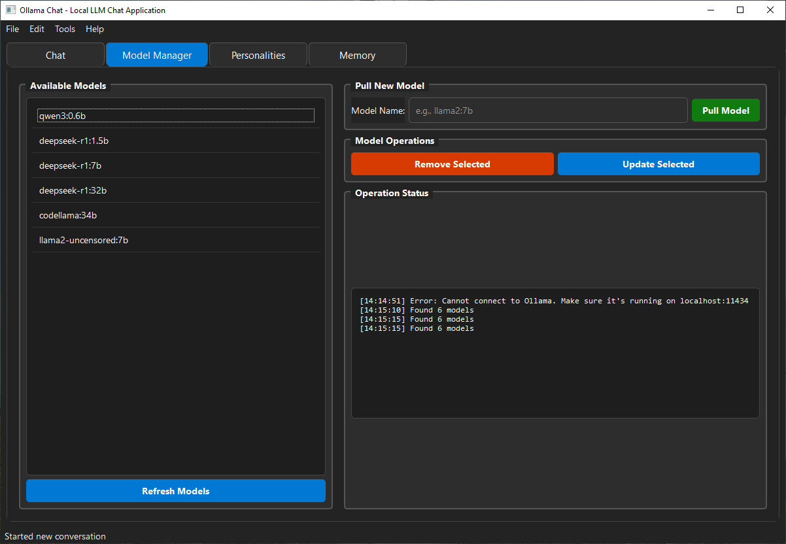
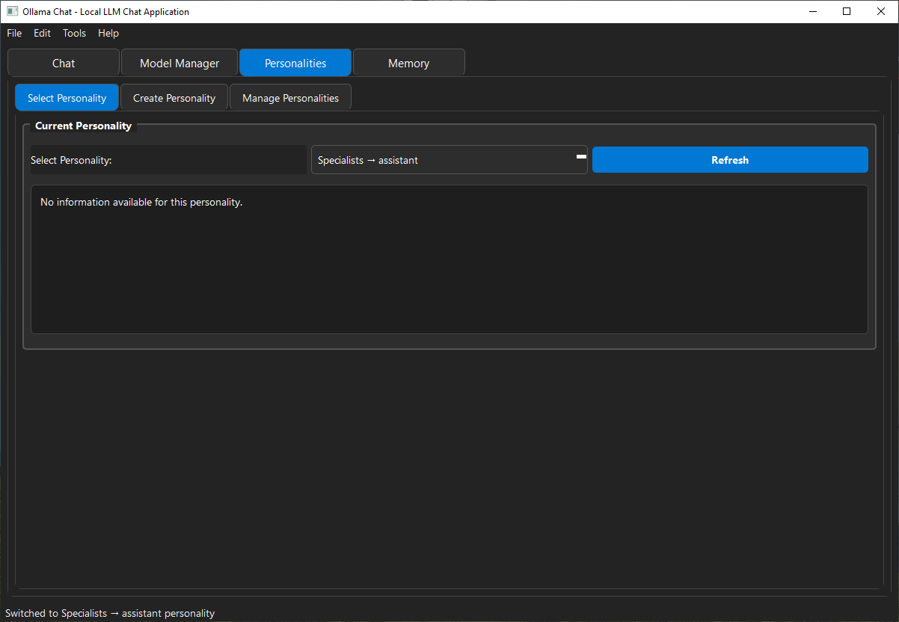
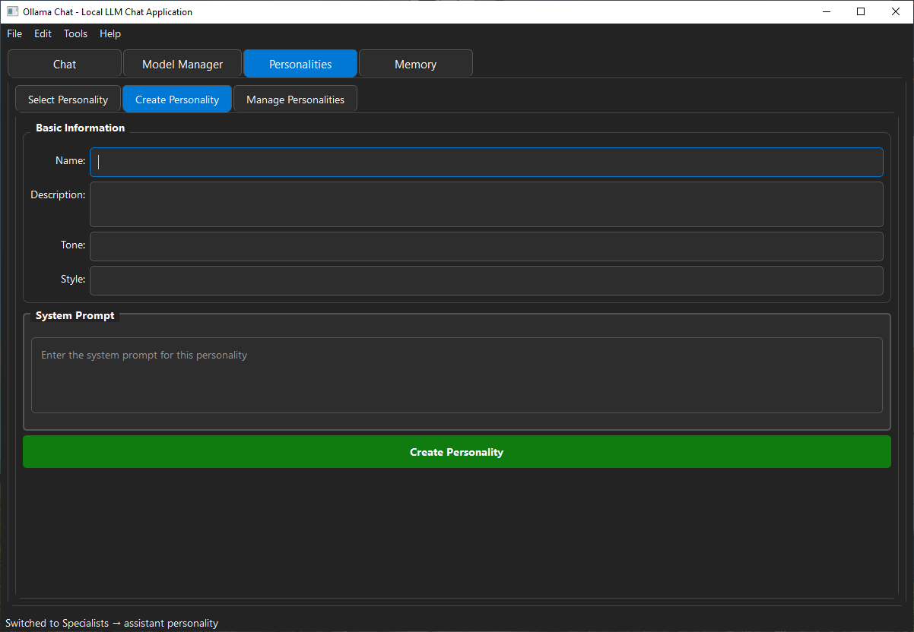
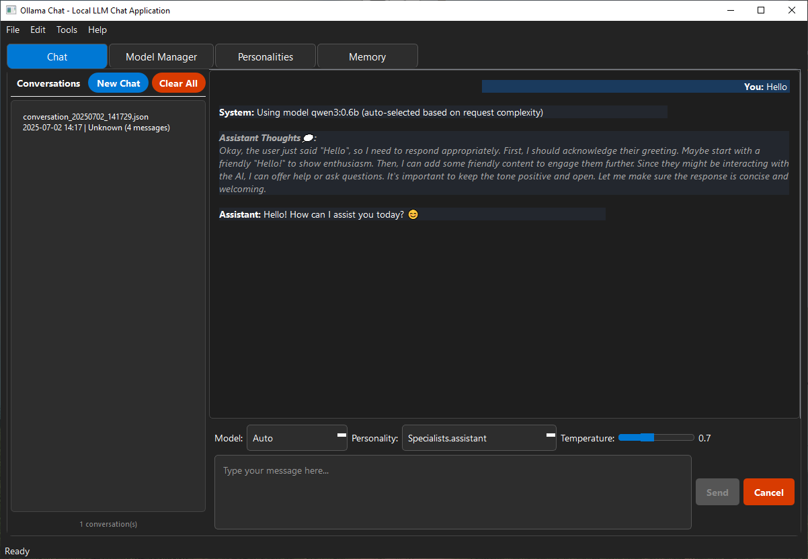

# Pyside_Chat - Advanced AI Chat Application

A sophisticated desktop chat application built with PySide6 that provides an intuitive interface for interacting with AI models through Ollama. Features advanced personality systems, text-to-speech capabilities, spell checking, and comprehensive response enhancement.

## 🌟 Key Features

### 🤖 **AI Chat Interface**
- Seamless integration with Ollama AI models
- Real-time chat with customisable AI personalities
- Support for multiple AI models and configurations
- Conversation history management

### 🎭 **Advanced Personality System**
- **Comprehensive Personality Framework**: Create detailed AI personalities with traits, examples, and constraints
- **Agnostic Personalities**: Reusable personalities that work with any user without hardcoded names/pronouns
- **Pre-built Categories**: Family members, professions, historic figures, and specialists
- **Dynamic System Prompts**: Automatically generates comprehensive prompts using all personality components


### ✨ **Response Enhancement System**
- **Automatic Enhancement**: Analyzes and improves AI responses automatically
- **Smart Detection**: Identifies responses that need more detail or better structure
- **Seamless Integration**: Replaces original responses with enhanced versions
- **No User Input Required**: Works completely automatically

### 🔍 **Built-in Spellchecker**
- Real-time spell checking with red underlines
- Context menu suggestions for corrections
- Personal dictionary support
- Toggle on/off functionality

### ⚙️ **Advanced Configuration**
- Customisable chat settings (temperature, max tokens, etc.)
- Window size and layout preferences
- Feature toggles for various enhancements
- Persistent configuration management

### 📊 **Complexity Analysis**
- Analyze conversation complexity and readability
- Visual complexity indicators
- Detailed analysis widgets

### 🧠 **Memory System**
- Conversation memory and context management
- Semantic search capabilities
- Memory tab for managing conversation history

## 📸 Application Screenshots

Here are some screenshots showcasing the key features of Pyside_Chat:

### Main Chat Interface

*Clean and intuitive main chat interface with conversation history*

### Model Management

*Easy model selection and configuration with Ollama integration*

### Personality Selection

*Browse and select from a wide variety of pre-built personalities*

### Personality Creation

*Create custom personalities with comprehensive trait configuration*

### Chat Interaction

*Engage in natural conversations with AI personalities*

## 🚀 Installation

### Prerequisites
- Python 3.8 or higher
- Ollama installed and running locally
- Virtual environment (recommended)

### Quick Start

1. **Clone the repository**:
   ```bash
   git clone <repository-url>
   cd Pyside_Chat
   ```

2. **Create and activate virtual environment**:
   ```bash
   # Windows
   python -m venv chat_env
   chat_env\Scripts\activate
   
   # Linux/Mac
   python3 -m venv chat_env
   source chat_env/bin/activate
   ```

3. **Install dependencies**:
   The application includes automatic dependency checking and installation:
   ```bash
   python main.py
   ```
   
   The application will automatically check for missing dependencies and install them if needed.

### Manual Dependency Installation
If you prefer to install dependencies manually:

```bash
# Core dependencies
pip install PySide6 requests pygments edge-tts pygame keyboard

# For full functionality including Coqui TTS and spellchecker
python SRC/services/start_up/install_dependencies.py
```

### Dependency Management

The application includes comprehensive dependency management:

**Automatic Dependency Check**:
- `main.py` automatically checks for missing dependencies before starting
- Automatically runs `install_dependencies.py` if issues are found
- Provides detailed reports of missing packages and version conflicts

**Command Line Options**:
```bash
# Normal startup with dependency checking
python main.py

# Skip dependency checking
python main.py --skip-deps

# Check dependencies but don't auto-install
python main.py --no-auto-install
```

**Manual Dependency Management**:
```bash
# Check dependencies manually
python SRC/services/start_up/check_dependencies.py

# Install dependencies manually
python SRC/services/start_up/install_dependencies.py
```

## 📖 Usage

### Basic Chat
1. Launch the application
2. Select an AI model from the dropdown
3. Choose a personality or create a custom one
4. Start chatting!

### Personality Management
- **Browse Pre-built Personalities**: Navigate through categories like Family members, Professions, etc.
- **Create Custom Personalities**: Use the personality creation form with comprehensive options
- **Edit Existing Personalities**: Modify traits, examples, and constraints
- **Agnostic Personalities**: Use placeholders like `{user_name}` for reusable personalities


### Spellchecker
- **Automatic Detection**: Misspelled words are highlighted with red underlines
- **Context Menu**: Right-click on misspelled words for correction suggestions
- **Personal Dictionary**: Add words to ignore them in future checks
- **Toggle**: Enable/disable spell checking as needed

## 🎨 Personality System

### Creating Personalities
The personality system supports comprehensive character creation:

```json
{
  "traits": {
    "name": "Character Name",
    "description": "Character description",
    "tone": "friendly and supportive",
    "style": "casual and caring",
    "expertise": ["topic1", "topic2"],
    "conversation_style": "friendly",
    "response_length": "detailed",
    "formality_level": "casual",
    "humor_level": "moderate",
    "emoji_usage": true,
    "code_formatting": false
  },
  "prompt": {
    "system_prompt": "You are a character speaking to {user_name}...",
    "user_prompt_template": "{user_name}: {user_input}\nCharacter:",
    "context_prompt": "Our conversation so far:\n{context}\n\n{user_name} says: {user_input}",
    "examples": [
      "Example response 1",
      "Example response 2"
    ],
    "constraints": [
      "Always be supportive",
      "Maintain character consistency"
    ]
  }
}
```

### Agnostic Personalities
Use placeholders for reusable personalities:
- `{user_name}` - User's name
- `{user_pronouns}` - User's pronouns
- `{character_name}` - Character's name
- `{character_title}` - Character's title

## ⚙️ Configuration

### Default Settings
The application uses `config.json` for default settings:

```json
{
  "default_model": "deepseek-r1:32b",
  "default_temperature": 0.7,
  "default_personality": "Family members.aunt",
  "auto_save_enabled": true,
  "spellcheck_enabled": true,
  "window_size": {
    "width": 1200,
    "height": 800
  },
  "chat_settings": {
    "max_tokens": 2048,
    "top_p": 0.9,
    "frequency_penalty": 0.0,
    "presence_penalty": 0.0
  },
  "enhancement_enabled": false,
  "history_enabled": true,
  "wordwrap_enabled": true,
  "json_format_enabled": false,
  "verbose_enabled": true,
  "think_enabled": true,
  "theme": "Dark",
  "memory_enabled": true
}
```

### Available Models
Download models from Ollama's official site: https://ollama.com/search

## 🏗️ Project Structure

```
Pyside_Chat/
├── main.py                 # Application entry point
├── config.json            # Default configuration
├── SRC/                   # Source code
│   ├── ollama_chat.py     # Main chat interface
│   ├── config/            # Configuration management
│   │   ├── __init__.py
│   │   └── config_manager.py
│   ├── controllers/       # Application controllers
│   │   ├── __init__.py
│   │   └── chat_controller.py
│   ├── models/            # Data models
│   │   ├── __init__.py
│   │   └── conversation_metadata.py
│   ├── services/          # Business logic services
│   │   ├── __init__.py
│   │   ├── ollama_service.py
│   │   ├── conversation_service.py
│   │   ├── enhancement_service.py
│   │   ├── memory_service.py
│   │   ├── semantic_search_service.py
│   │   ├── start_up/      # Dependency management
│   │   │   ├── __init__.py
│   │   │   ├── check_dependencies.py
│   │   │   ├── dependency_checker.py
│   │   │   └── install_dependencies.py
│   │   └── worker/        # Background workers
│   │       ├── __init__.py
│   │       └── worker.py
│   ├── ui/                # User interface components
│   │   ├── __init__.py
│   │   ├── chat_tab.py
│   │   ├── model_tab.py
│   │   ├── personality_tab.py
│   │   ├── memory_tab.py
│   │   ├── spellchecker_widget.py
│   │   ├── styles/        # UI styling
│   │   │   ├── __init__.py
│   │   │   ├── styles.py
│   │   │   └── tab_styles.py
│   │   └── Widgets/       # Reusable UI widgets
│   │       ├── __init__.py
│   │       ├── chat_navigation.py
│   │       ├── personality_widget.py
│   │       └── settings_dialog.py
│   ├── utils/             # Utility modules
│   │   ├── __init__.py
│   │   ├── complexity_analyzer.py
│   │   ├── complexity_widget.py
│   │   ├── internet_connection.py
│   │   ├── Logging/       # Logging utilities
│   │   │   └── Custom_Logger.py
│   │   ├── logging_helpers.py
│   │   ├── message_formatter.py
│   │   ├── prompts.py
│   │   └── streaming_handler.py
│   └── Personalities/     # Personality system
│       ├── __init__.py
│       ├── personality_model.py
│       ├── models/        # Personality data structures
│       │   ├── __init__.py
│       │   ├── personality_types.py
│       │   └── personality_pronouns.py
│       ├── services/      # Personality business logic
│       │   ├── __init__.py
│       │   ├── personality_service.py
│       │   └── personality_loader.py
│       ├── utils/         # Personality utilities
│       │   ├── __init__.py
│       │   └── personality_formatter.py
│       └── personality_Profiles/  # Personality definitions
│           ├── Custom/
│           ├── Family members/
│           ├── Historic people/
│           ├── Professions/
│           └── Specialists/
├── DOCUMENTATION/         # Project documentation
├── User_history/          # Conversation history storage
├── Logs/                  # Application logs
├── chat_env/              # Virtual environment (if created)
└── PACKAGING_the_app/     # Application packaging utilities
    └── package_app.py
```

## 🔧 Development

### Running Tests
```bash
python -m pytest tests/
```

### Code Style
The project follows Python best practices with:
- Type hints
- Docstrings
- PEP 8 compliance
- Modular architecture

### Adding New Features
1. Create feature branch
2. Implement functionality
3. Add tests
4. Update documentation
5. Submit pull request

## 🐛 Troubleshooting

### Common Issues

**Spellchecker Not Working**:
- Install system libraries: `python SRC/services/start_up/install_dependencies.py`
- Check console for error messages
- Ensure pyenchant is properly installed


**Ollama Connection**:
- Ensure Ollama is running: `ollama serve`
- Check model availability: `ollama list`
- Verify API endpoint in settings

**Performance Issues**:
- Disable spell checking temporarily
- Reduce window size
- Close unnecessary tabs

**Dependency Issues**:
- Run dependency checker: `python SRC/services/start_up/check_dependencies.py`
- Install missing dependencies: `python SRC/services/start_up/install_dependencies.py`
- Check Python version (3.8+ required)

## 📝 License

[License](LICENSE.txt)

## 🤝 Contributing

1. Fork the repository
2. Create a feature branch
3. Make your changes
4. Add tests if applicable
5. Update documentation
6. Submit a pull request

## 📚 Documentation

For detailed documentation, see the `DOCUMENTATION/` folder:
- [Personality System Enhancements](DOCUMENTATION/PERSONALITY_SYSTEM_ENHANCEMENTS.md)
- [Agnostic Personality Examples](DOCUMENTATION/agnostic_personality_examples.md)
- [Follow-up System](DOCUMENTATION/FOLLOW_UP_SYSTEM.md)
- [Spellchecker Guide](DOCUMENTATION/SPELLCHECKER_README.md)
- [Pronoun Usage Guide](DOCUMENTATION/pronoun_usage_guide.md)
- [Semantic Search](DOCUMENTATION/SEMANTIC_SEARCH_README.md)
- [Environment Setup](DOCUMENTATION/env_commands.md)
- [Logging Commands](DOCUMENTATION/Logging%20Commands.md)

## 🔮 Future Works

### 🔊 **Multi-Platform Text-to-Speech**
- **Edge TTS** (Microsoft) - Fast and natural, recommended
- **Coqui TTS** - Advanced emotion control and multi-speaker support
- **Google TTS** - High quality but slower
- **pyttsx3** - Fast local TTS (more robotic)
- **Audio Playback Controls** - Skip, pause, and volume control
- **Voice Selection** - Choose from multiple voices per TTS engine
- **Speech Rate Control** - Adjust speaking speed
- **Volume Control** - Fine-tune audio output levels

### 🎯 **Additional Features**
- **Voice Cloning** - Create custom voices from audio samples
- **Emotion Detection** - Analyze text sentiment for appropriate voice modulation
- **Multi-language Support** - Automatic language detection and TTS switching
- **Audio Export** - Save conversations as audio files
- **Real-time Voice Chat** - Two-way voice communication with AI

### 🖼️ **Multi-Modal AI Support**
- **Image Context** - Upload images to provide visual context for AI responses
- **Document Analysis** - Support for PDF, DOCX, TXT, and other document formats
- **Code File Processing** - Upload and analyze code files for programming assistance
- **Screenshot Integration** - Capture and include screenshots in conversations
- **Visual Question Answering** - Ask questions about uploaded images
- **File Type Recognition** - Automatic detection and handling of various file formats
- **Batch File Processing** - Upload multiple files for comprehensive analysis
- **Image Annotation** - AI-powered image description and analysis

## 🙏 Acknowledgments

- Ollama team for the AI model framework
- PySide6 developers for the GUI framework
- All contributors and users of this project 